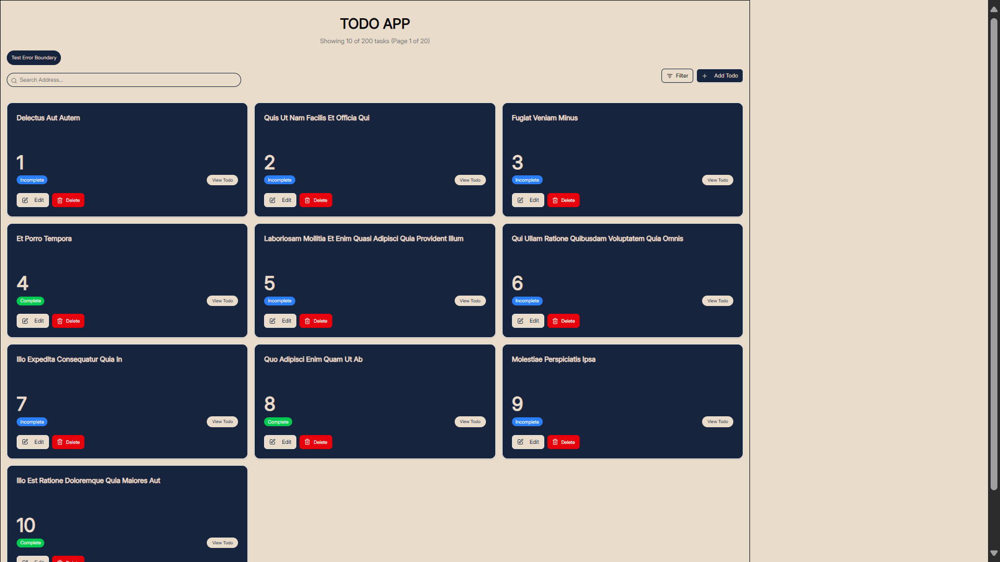
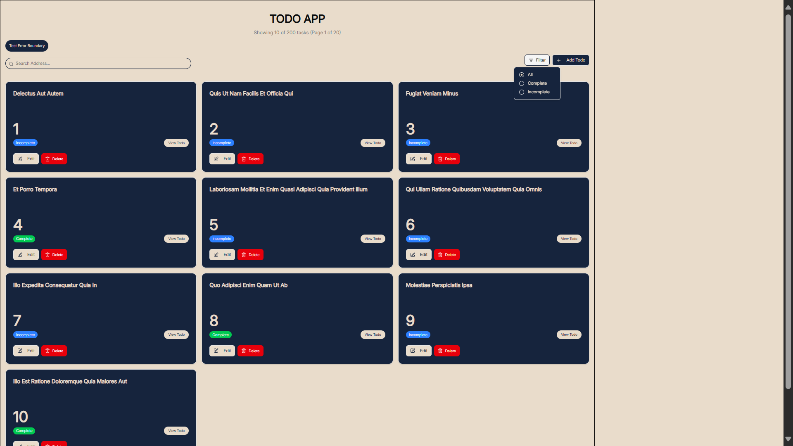
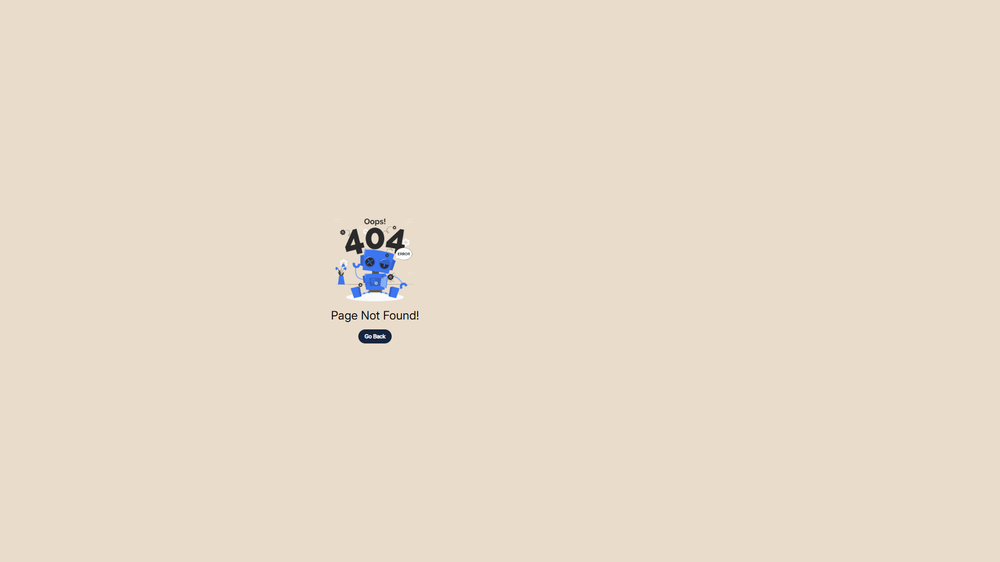
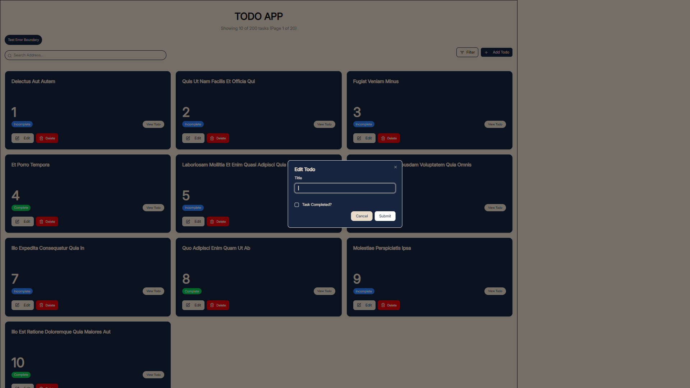
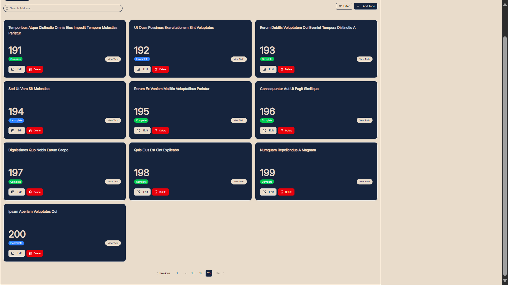
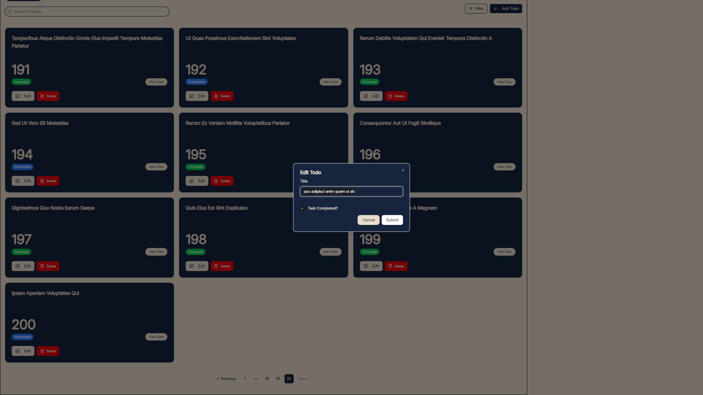
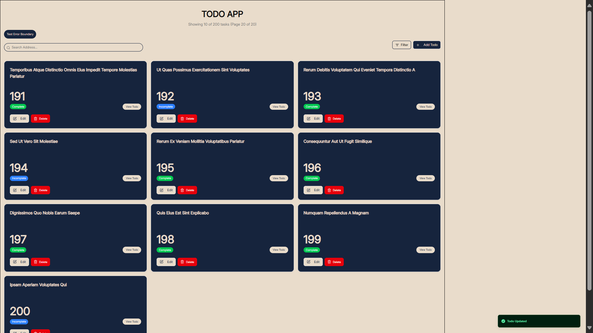

# ALT-SCHOOL EXAM SUBMISSON

## A SIMPLE TODOAPP THAT UTILIZES REACT AND MODERN LIBRARIES TO DISPLAY TODO TASKS WITH PAGINATION AND OTHER BASIS FUNCTIONALITIES

## FEATURES

- Display of all todos
- Deleting of a todo task
- Updating a todo task
= Display of a single todo on a page
- Search for todos by title
- Pagination of todo data
- Filter by todo status

## INSTALLATION AND SETUP

- Vite was used in bootrapping the react-app

```bash
npm create vite@latest
```

- Tailwind installed

```bash
npm install tailwindcss @tailwindcss/vite
```

- Jsconfig file created at the root for absolute path feature. Usage:

```bash
import Button from '@/components/ui/button.jsx'
```

- Useful libraries installed with:

```bash
npm install <pkg>
```

## AVAILABLE SCRIPTS AND COMMAND

- Run the app:

```bash
npm run dev
```

- Run local build

```bash
npm run build
```

## TECHNOLOGY STACK AND ARCHITECTURAL DECISIONS

### TECHNOLOGY STACK

- React
- Tailwind
- Shadcn
- React Router
- Tanstack React-Query
- Lucide-react

### ARCHITECTURAL DECISIONS

- Pages folder for separation of containers to be displayed on the web
- Assets folder for images
- Custom hooks housed in hooks folder
- Router setup in router folder
- Tailwind for ease of styling
- Shadcn and Reusabled components in components folder
- Reusable components in components/common folder for components that are used often in all pages

## SCREENSHOTS






